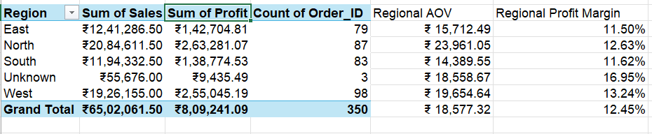
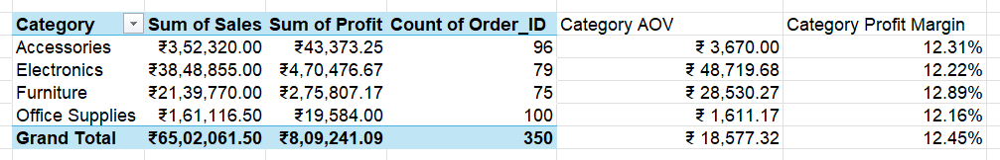
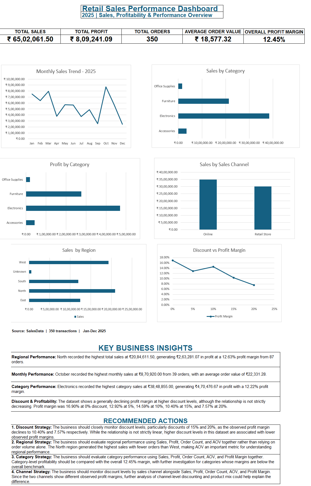

# Retail Sales Performance Analysis

## Project Overview

Retail Sales Performance Analysis is an Excel-based data analytics portfolio project using retail transaction data for 2025.

The project follows a complete analytics workflow: data inspection, data cleaning, validation, KPI calculation, PivotTable analysis, visualization, dashboard development, business insights, and recommended actions.

The analysis focuses on sales performance, profitability, order volume, average order value, regional performance, category and product performance, monthly trends, sales channels, and discount-related profitability patterns.

## Business Objective

The objective of this project is to evaluate retail sales performance for 2025 and identify patterns across key business dimensions.

The analysis aims to answer questions such as:

- What are the overall Sales, Profit, Order Count, Average Order Value, and Profit Margin?
- How does performance vary across Regions?
- Which Categories and Products contribute most to Sales and Profit?
- How does Sales performance change month by month?
- How do Online and Retail Store channels compare?
- How does observed Profit Margin vary across different Discount levels?

## Dataset

The project uses a retail sales transaction dataset covering January–December 2025.

The original dataset contains 350 transaction records and 13 business fields covering order details, customer information, product and category details, pricing, discounts, sales, profit, payment methods, and sales channels.

During data preparation, the raw dataset was preserved and a separate cleaned dataset was created. The cleaned dataset includes a derived `Profit_Margin` field for profitability analysis.

Key data-quality issues identified during inspection included duplicate Order IDs, missing Customer IDs, missing Region values, and inconsistent capitalization in Category values.

## Tools & Skills

### Tools

- Microsoft Excel

### Excel Skills Used

- Data inspection and data cleaning
- Missing-value handling
- Duplicate identifier investigation and correction
- Data validation using Excel formulas
- Excel Tables
- Structured references
- KPI calculation
- PivotTables
- Pivot-based analysis
- Chart creation and formatting
- Dashboard development
- Business insight generation
- Data documentation and cleaning logs

### Key Excel Functions

- `SUM`
- `COUNTA`
- `COUNTIF`
- `COUNTIFS`
- `ROUND`
- `TRIM`
- `CLEAN`

## Data Cleaning

The raw dataset was preserved as the source, while all cleaning activities were performed on a separate `Cleaned_Sales_Data` sheet.

### Cleaning steps performed

1. **Duplicate Order IDs**
   - Identified two Order IDs that appeared twice.
   - The corresponding transaction details were different, so the records were preserved.
   - The second occurrences were reassigned to new unique IDs: `ORD-0351` and `ORD-0352`.

2. **Missing Customer IDs**
   - Identified 3 blank `Customer_ID` values.
   - The missing values could not be reliably recovered from the available data.
   - Replaced the blanks with `Unknown` to preserve the transactions.

3. **Missing Regions**
   - Identified 3 blank `Region` values.
   - Customer history did not provide sufficient evidence to assign a reliable Region in all cases.
   - Replaced the blanks with `Unknown`.

4. **Category Standardization**
   - Identified inconsistent capitalization in the `Category` field.
   - Standardized the category values to:
     - `Accessories`
     - `Electronics`
     - `Furniture`
     - `Office Supplies`

### Data Validation

The cleaned dataset was validated using Excel formulas and cross-checks:

- 350/350 Sales calculations matched the expected formula.
- 350/350 Order IDs were verified as unique.
- 350/350 Product–Category relationships were consistent.
- 350/350 records passed the text-space validation check.
- Quantity values were within the documented 1–6 range.
- Discount values were within the documented 0%–20% range.

## Analysis & KPIs

The cleaned dataset was analyzed using Excel formulas and PivotTables to evaluate performance across multiple business dimensions.





### Core KPIs

| KPI | Value |
|---|---:|
| Total Sales | ₹65,02,061.50 |
| Total Profit | ₹8,09,241.09 |
| Total Orders | 350 |
| Average Order Value | ₹18,577.32 |
| Overall Profit Margin | 12.45% |

### Analytical Breakdowns

The analysis was performed across:

- **Region:** Sales, Profit, Order Count, AOV, and Profit Margin
- **Category:** Sales, Profit, Order Count, AOV, and Profit Margin
- **Product:** Sales, Profit, Order Count, AOV, and Profit Margin
- **Month:** Monthly Sales, Profit, Order Count, AOV, and Profit Margin
- **Sales Channel:** Sales, Profit, Order Count, AOV, and Profit Margin
- **Discount Level:** Sales, Profit, Order Count, AOV, and Profit Margin
- **Payment Method:** Sales, Profit, Order Count, AOV, and Profit Margin

Calculated fields and analytical measures were created from the cleaned dataset and validated against the overall totals.

## Dashboard



An interactive Excel dashboard was developed to provide a consolidated view of retail sales performance for 2025.

The dashboard includes:

- KPI cards for Total Sales, Total Profit, Total Orders, Average Order Value, and Overall Profit Margin
- Monthly Sales Trend
- Sales by Category
- Profit by Category
- Sales by Sales Channel
- Sales by Region
- Discount vs Profit Margin
- Key Business Insights
- Recommended Actions

The dashboard is connected to the analysis outputs so that the reported KPI values and visualizations reflect the cleaned dataset.

## Key Business Insights

### Regional Performance

North recorded the highest regional sales at ₹20,84,611.50, generating ₹2,63,281.07 in profit with a 12.63% profit margin from 87 orders. North also had a higher AOV than West despite having fewer orders.

### Monthly Performance

October recorded the highest monthly sales at ₹8,70,920.00 from 39 orders, with an average order value of ₹22,331.28.

### Category Performance

Electronics recorded the highest category sales at ₹38,48,855.00, generating ₹4,70,476.67 in profit with a 12.22% profit margin.

### Discount & Profitability

The dataset shows a generally declining profit margin at higher discount levels, although the relationship is not strictly decreasing. Observed profit margins were 16.90% at 0%, 12.92% at 5%, 14.59% at 10%, 10.40% at 15%, and 7.57% at 20% discount.

## Recommended Actions

### 1. Discount Strategy

The business should closely monitor discount levels, particularly discounts of 15% and 20%, as the observed profit margin declines to 10.40% and 7.57% respectively. While the relationship is not strictly linear, higher discount levels in this dataset are associated with lower observed profit margins.

### 2. Regional Strategy

The business should evaluate regional performance using Sales, Profit, Order Count, and AOV together rather than relying on order volume alone. The North region generated the highest sales with fewer orders than West, making AOV an important metric for understanding regional performance.

### 3. Category Strategy

The business should evaluate category performance using Sales, Profit, Order Count, AOV, and Profit Margin together. Category-level profitability should be compared with the overall 12.45% margin, with further investigation for categories whose margins are below the overall benchmark.

### 4. Channel Strategy

The business should monitor discount levels by sales channel alongside Sales, Profit, Order Count, AOV, and Profit Margin. Since the two channels show different observed profit margins, further analysis of channel-level discounting and product mix could help explain the difference.

## Project Structure

```text
Retail-Sales-Performance-Analysis/
│
├── Retail_Sales_Performance_Analysis_2025.xlsx
├── README.md
│
└── screenshots/
    ├── dashboard.png
    ├── regional_analysis.png
    └── category_analysis.png
```

### Workbook Structure

The Excel workbook contains:

- `Dashboard` — final KPI dashboard, visualizations, insights, and recommended actions
- `Analysis` — core KPI calculations
- `Pivot_Analysis` — analytical PivotTables
- `Chart` — visualization workspace
- `Chart_Data` — supporting data ranges for charts
- `Cleaned_Sales_Data` — cleaned and validated dataset
- `Cleaning_Log` — documented data-cleaning decisions and validation
- `Data_Dictionary` — field definitions and business rules
- `Raw_Sales_Data` — original dataset
- `Project_Guide` — project instructions and scope

## Author

**Aman Yadav**

M.Sc. Physics | Aspiring Data Analyst

Skills: Excel | Python | SQL | Power BI | Data Analysis

This project was created as part of my transition into Data Analytics, with a focus on practical data cleaning, analysis, visualization, and business reporting.
